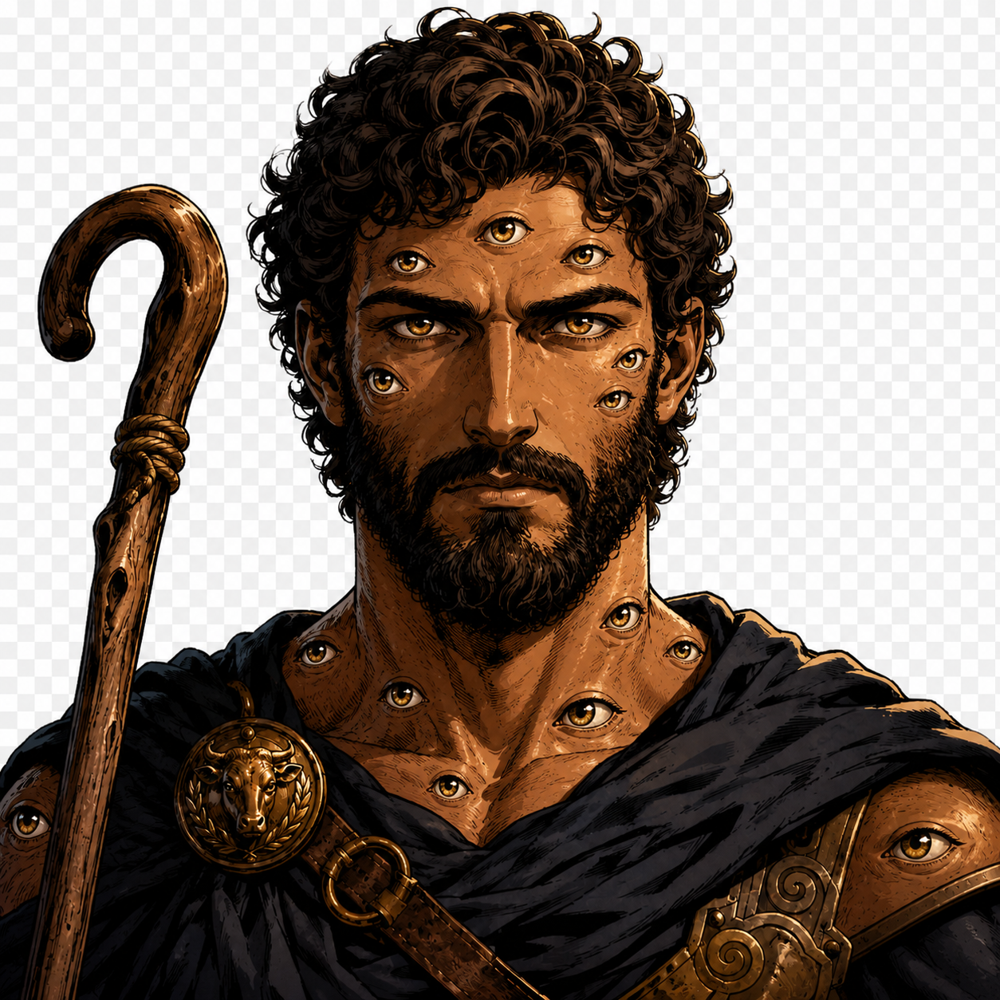
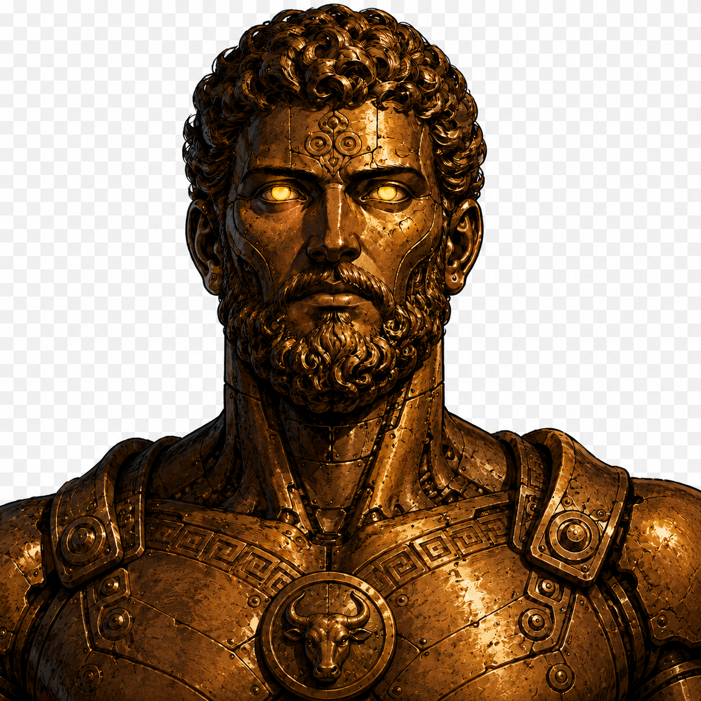
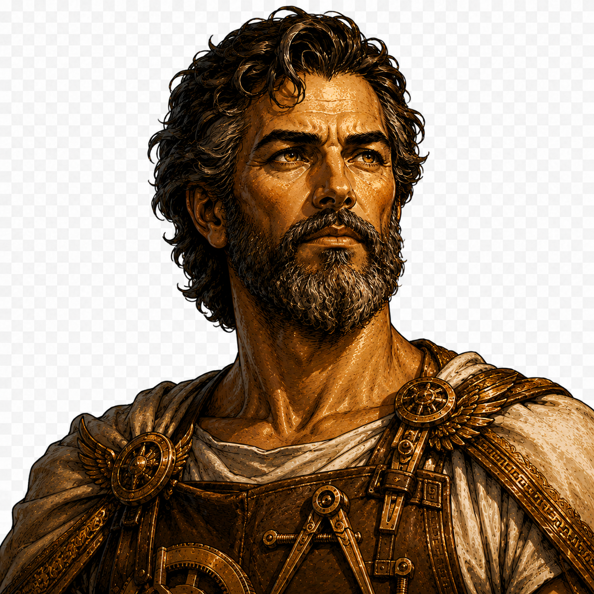

# Agents

Agents are **Claude Code subagents** that act as a thin orchestration layer over the existing skills. They run in their own context window, delegate the real work to skills, and hand a clean result back to the caller.

```text
Rules  = long-lived project standards
Skills = reusable workflows
Agents = specialised orchestration roles over multiple skills
```

## Agent roster

Every agent has its own avatar under [`assets/agents/`](../assets/agents). When no custom artwork has been supplied yet, the slot falls back to the universal placeholder ([`placeholder.svg`](../assets/agents/placeholder.svg)) — swap `assets/agents/<name>.svg` to give an agent its own face.

###  `argos` — code-review gatekeeper

The all-seeing code-review gatekeeper, named after **Argos Panoptes**, the hundred-eyed watcher nothing escaped. Give it a PR — from the current context or a tracker link (GitHub, JIRA, Bugsnag) — and it loads the source, runs the matching `code-review-*` wrapper skill, posts the findings to the PR, and hands back a `CR done` summary with links and Critical / Moderate / Minor counts.

- **Trigger:** a pull request needs reviewing.
- **Orchestrates:** `code-review-github`, `code-review-jira`, `code-review-bugsnag`.
- **Safety:** read-only — never edits, commits, pushes, or merges.

###  `talos` — code-writing implementer

The tireless bronze automaton, named after **Talos**, the forged guardian that worked without rest. Give it a source — a tracker link (GitHub, JIRA, Bugsnag) or the current task — and it implements the fix or feature, validates it with tests, opens a pull request, and hands back an `Impl done` summary with links. It is the write-side counterpart to `argos`: `argos` is the tireless eye (review), `talos` the tireless hands (implementation).

- **Trigger:** an issue or task needs implementing.
- **Orchestrates:** `resolve-issue`.
- **Safety:** stops at the PR — never reviews its own work and never merges.

###  `metis` — problem-analysis advisor

The counsel of wise planning, named after **Metis**, the Titaness of deliberation and cunning planning (and mother of Athena). Give it a problem — a tracker link, a described failure, or an under-specified assignment — and it runs the analyze-problem framework, proposes the smallest safe solution, and publishes a reusable plan as a GitHub issue, then hands back an `Analysis done` summary. It is the thinking front-end to the roster: `metis` the mind (analysis), `talos` the hands (implementation), `argos` the eyes (review).

- **Trigger:** a problem needs analysis, or a vague assignment needs a proposed solution before any code is written.
- **Orchestrates:** `analyze-problem`.
- **Safety:** read-only — never edits, commits, pushes, or implements; publishes its plan to the tracker.

###  `daidalos` — engineering-workflow orchestrator

The master craftsman who runs the workshop, named after **Daidalos**, the legendary engineer who designed the work and directed the makers. It is the **entry point** for a free-form engineering request — *"resolve a random issue"*, *"resolve this URL"*, *"implement this"* — and the conductor that drives the job to a clean, reviewed result. It resolves a concrete source, decides whether the task needs a plan first, then **delegates each step by dispatching the matching specialist agent** through the Task tool — `metis` (analysis, if needed), `talos` (implementation), `argos` (the **review-and-fix loop `talos` ↔ `argos` to convergence**, no Critical/Moderate findings) — and reports the result to the user. `metis` the mind, `talos` the hands, `argos` the eyes; `daidalos` the workshop lead that directs them.

- **Trigger:** a free-form engineering request — from a vague idea to a tracker link — that should be carried end to end.
- **Orchestrates (dispatches via the Task tool):** `metis` (analysis step — owns `analyze-problem`), `talos` (implementation step — owns `resolve-issue`, which already loops `code-review` + `security-review` to 0 Critical/Moderate before the PR), `argos` (the `talos` ↔ `argos` convergence loop — owns `process-code-review` / `code-review-github`, `maxIterations = 5`); resolves the source itself reusing `autoresolve-oldest-github-issue` selection and `resolve-issue` source detection.
- **Convergence gate:** the run is done only at **0 Critical + 0 Moderate**; on `maxIterations` or a blocker it stops and escalates rather than reporting success. Merging stays a separate, explicit step.
- **Safety:** read-only orchestrator — never analyses, implements, or reviews itself; it delegates each step by dispatching the matching specialist agent, the iteration loop is skill-driven (state lives in the skill the specialist owns), and it must be the top-level agent (not a nested subagent) per the one-level nesting rule below — that single level is what it spends to dispatch `metis` / `talos` / `argos`.

###  `momus` — human-perspective PR tester

The fault-finding tester, named after **Momus**, the god of criticism, satire, and fault-finding who found a flaw in every work the gods made. Give it a pull request — from the current context or a tracker link (GitHub, JIRA, Bugsnag) — and it walks the change like a real user: it understands the assignment, exercises the app (UI / API / CLI), runs the mandatory `curl` checks on API changes, publishes a human-readable report to the PR via `pr-summary`, and hands back a `Test done` summary with `pass / fail / blocked / unclear` scenario counts and a readiness verdict. It is a thin wrapper over `test-like-human` — the same read-only-wrapper-plus-handoff shape as `argos`.

- **Trigger:** a pull request needs validating from a real user's perspective — typically **on demand after `argos` has converged the review-and-fix loop**, not as part of it.
- **Orchestrates:** `test-like-human` (which itself publishes through `pr-summary`).
- **Safety:** read-only — never edits, commits, pushes, or merges; writing missing automated tests is out of scope (it records the gap and recommends `talos` / `create-test`).
- **On-demand, outside the loop:** `test-like-human` is never auto-chained from the review pipeline, so `momus` is dispatched explicitly and is **not** part of the `daidalos` convergence loop.

> A future top-level, cross-domain orchestrator (reserved name `zeus`) will sit above `daidalos` and coordinate non-engineering domains too (e.g. marketing). `daidalos` owns the engineering tier only.

## Naming convention — Greek mythology

Every agent is named after a figure from **Greek mythology**, chosen so the figure's role matches the agent's function. Use the lowercase name as the agent `name:` and file id (`agents/<name>.md`).

| Agent | Greek figure | Why it fits |
|---|---|---|
| `argos` | Argos Panoptes, the hundred-eyed all-seeing watcher | nothing escapes his gaze → thorough PR inspection |
| `talos` | Talos, the bronze automaton forged to work and guard without rest | tireless artificial labourer → forges working code |
| `metis` | Metis, Titaness of wise counsel and cunning planning | deliberation before action → problem analysis & planning |
| `daidalos` | Daidalos, the master craftsman who runs the workshop and directs the makers | head of production → routes engineering work to the right specialist |
| `momus` | Momus, the god of criticism, satire, and fault-finding | finds the flaw in every work → user-perspective testing |

Naming ideas for future agents: `themis` (order / verdict), `rhadamanthys` (fair judge), `athena` (wisdom / architecture), `hermes` (delivery / merge), `zeus` (top-level cross-domain orchestrator above `daidalos`).

## Anatomy of an agent

An agent is a Markdown file with frontmatter + a system prompt:

```markdown
---
name: argos
description: When to auto-delegate to this agent (the trigger sentence).
tools: Read, Glob, Grep, Bash
model: opus
---

System prompt: what the agent does, which skills it orchestrates, and the handoff it returns.
```

- **`name`** — lowercase, the id used as `subagent_type` / `@name`.
- **`description`** — drives auto-delegation; phrase it as the situation that should trigger the agent.
- **`tools`** — restrict to what the agent needs. A read-only reviewer needs `Read, Glob, Grep, Bash` only.
- **System prompt** — orchestration only. Delegate to skills via `@skills/<name>/SKILL.md`; **never duplicate a skill's rules** — defer to the skill as the source of truth.

## Handoff contract

An agent's final message is returned to the caller as the tool result, so it must be a self-contained handoff the next agent can act on without re-deriving context:

- **Status** — e.g. `CR done`.
- **Links** — the PR and the originating source (GitHub / JIRA / Bugsnag).
- **Result summary** — the numbers the caller needs (e.g. Critical / Moderate / Minor counts, a verdict).

**Language of the handoff / report.** Every agent writes the human-facing prose of its handoff and any end-user report in the **same natural language the assignment was given in** (if the request came in Czech, the handoff is in Czech). Identifiers stay verbatim regardless of that language — branch names, ticket / issue keys, links, severity labels, CLI commands, and skill / agent names are never translated, and two natural languages are never mixed inside a single handoff.

## Subagents of an agent

Claude Code subagents invoked via the Task tool generally **cannot spawn their own subagents** (one level of nesting). This shapes how the roster composes:

1. **A top-level orchestrator dispatches specialists through the Task tool.** `daidalos` runs as the top-level agent the user talks to, and spends its single nesting level dispatching `metis` / `talos` / `argos` directly. Each specialist then orchestrates its own skills inline — `talos` runs `resolve-issue`, `argos` runs `code-review-github`, and so on.
2. **Lens skills called inline** by an orchestrating skill — e.g. `code-review-github` already runs `code-review`, `security-review`, `api-review`, `assignment-compliance-check` inline. This is what each dispatched specialist does in its own context, and it is also the fallback when no further nesting level is available.
3. **Parallel fan-out via the Workflow tool** — a DAG of agents for heavy runs that genuinely need concurrency.

Because of the one-level limit, an orchestrator like `daidalos` must be the **top-level agent the user talks to** — it delegates each step by dispatching the matching specialist agent (or, if `daidalos` was itself invoked headless and the nesting level is already spent, returns a routing handoff for the caller to execute), never by becoming a nested subagent that tries to spawn `metis` / `talos` / `argos` from inside another agent. A future `zeus → daidalos → specialist` chain cannot stack three Task-subagent levels; it must collapse to a single dispatch level plus the inline / Workflow model.

### End-to-end run (agent-dispatched, skill-owned loop)

The `daidalos` run carries a request all the way to a clean, reviewed result. `daidalos` resolves the source itself, then **dispatches each step as the matching specialist agent through the Task tool**; the iterative `talos` ↔ `argos` review-and-fix loop is **owned by the skill the dispatched specialist drives** (its state lives there), not modelled as agents calling agents:

```text
user → daidalos                                         (top-level; resolves source, then dispatches via Task tool)
         │  resolve source (autoresolve-oldest-github-issue selection / resolve-issue source-detection)
         │  analyse? ── yes ─→ Task ▶ metis   (= analyze-problem → plan)
         │     │ no
         ▼     ▼
       Task ▶ talos   (= resolve-issue)
         │        └─ inline loop: code-review + security-review → 0 Critical/Moderate → opens PR
         ▼
       Task ▶ argos   (= process-code-review / code-review-github — the talos ↔ argos loop)
                  └─ convergence loop: code-review-github (quiet) + fixes, maxIterations 5 → 0 Critical/Moderate
         ▼
       daidalos → reports result to the user   (merge stays a separate, explicit step)
```

The convergence gate is **0 Critical + 0 Moderate**; on `maxIterations` or a blocker the run stops and escalates instead of reporting success.

## Troubleshooting — subagent file writes blocked

**Symptom:** a write-capable agent (`talos`) reports it cannot write files — *"sandbox blocking file writes"* — and the run stops with a `Blocked: sandbox denied file write` handoff (or the main thread is tempted to finish the implementation itself).

**Cause:** the agent declares `Write` / `Edit` in its frontmatter, but those tools are *capabilities*, not grants. A dispatched subagent runs **non-interactively** — when its `Edit` / `Write` is not already pre-allowed for the path it targets, it cannot fall back to an interactive approval the way the main thread can, so the write is denied at runtime. This is an environment setting, not something the agent definition or this package can grant.

**Correct behaviour (already enforced):** the blocked agent returns `Blocked: sandbox denied file write` and the orchestrator escalates it — the work is **never** silently completed outside the delegated, reviewed pipeline (`@rules/compound-engineering/general.mdc` *Blocked delegation is a hard stop*).

**Remediation (the human enables subagent writes) — pre-allow scoped `Edit` / `Write` on the working tree.** Add two scoped allow entries to **`permissions.allow`** in the project's `.claude/settings.local.json`, naming the project's absolute path:

```json
{
  "permissions": {
    "allow": [
      "Edit(//Users/me/Projects/my-app/**)",
      "Write(//Users/me/Projects/my-app/**)"
    ]
  }
}
```

This is the permanent, recommended fix: a dispatched subagent then writes the working tree without an interactive prompt. `settings.local.json` (personal, git-ignored) is the right home because the entries carry your machine-absolute path. A blanket `acceptEdits` permission mode also works for an interactive session, but the scoped allow entries survive across sessions and headless runs. See the Claude Code [permissions](https://code.claude.com/docs/en/permissions) and [subagents](https://code.claude.com/docs/en/sub-agents) docs.

**Installer shortcut (opt-in).** The fix above can be applied for you: run the installer with `--allow-subagent-writes` (with `--editor=claude` or `--editor=all`) and it prepends `Edit(//<project>/**)` and `Write(//<project>/**)` to `permissions.allow` in the project's `.claude/settings.local.json`, validating the result so it can never be written malformed. It leaves existing allow entries untouched and is idempotent. This package still grants **nothing by default** — the flag is the explicit, human-owned opt-in, never automatic.

## Distribution

The installer copies `agents/` to `.claude/agents/` for `--editor=claude` and `--editor=all` only — Claude Code is the only editor with a native subagent format, so `--editor=cursor` and `--editor=codex` skip agents.

## Adding a new agent

1. Pick a Greek figure whose myth matches the job; use the lowercase name.
2. Create `agents/<name>.md` with the frontmatter + an orchestration-only system prompt that delegates to skills and returns a handoff.
3. Add it to the README *Claude Code Subagents* table.
4. Add a test asserting the file ships with its required frontmatter (mirror the `argos` test in `tests/InstallerTest.php`).
5. Run `composer build` — the installer file-count tests pick up the new agent automatically.
