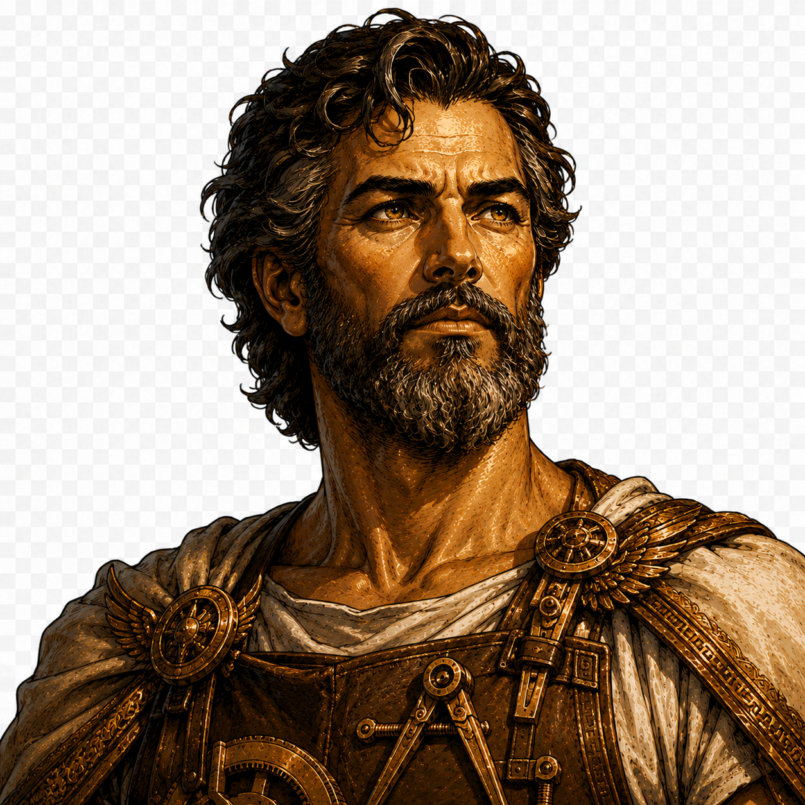

# Agents

Agents are **Claude Code subagents** that act as a thin orchestration layer over the existing skills. They run in their own context window, delegate the real work to skills, and hand a clean result back to the caller.

```text
Rules  = long-lived project standards
Skills = reusable workflows
Agents = specialised orchestration roles over multiple skills
```

## Agent roster

Every agent has its own avatar under [`assets/agents/`](../assets/agents). When no custom artwork has been supplied yet, the slot falls back to the universal placeholder ([`placeholder.svg`](../assets/agents/placeholder.svg)) — swap `assets/agents/<name>.svg` to give an agent its own face.

###  `athena` — the single code-review agent

The project's **only** code-review agent and its strategic security sentinel, named after **Athena**, goddess of wisdom and strategic defence, and daughter of Metis. She owns the **whole review domain in one pass** — code quality, architecture, optimisation **and** security — in **two modes**. (1) **Security analysis (pre-implementation)** — dispatched on demand when the task carries a cyber-security question: it scopes the security risk through all security skills, frames the smallest safe remediation via `analyze-problem`, publishes a plan artifact, and hands back a `Security analysis done` summary that `talos` implements. (2) **Code review (post-implementation)** — given a PR from the current context or a tracker link, it loads the source, runs the matching `code-review-*` wrapper skill (which drives every CR lens the project defines), deepens it with the remaining security skills over the same diff, applies all security rules, labels each finding (Critical / Moderate / Minor), posts **one** consolidated review, and hands back a `CR done` summary with links and counts.

**One CR agent, one pass, one diff.** There is no second reviewer and no separate security comment to consolidate: quality, architecture, optimisation and security findings share the same severity buckets in the same report. One pass over one diff costs a fraction of two overlapping passes and reaches the same verdict.

**Scope: the current changes only.** Every lens — including the ones that can sweep a whole application (`laravel-security`, `security-bounty-hunter`, `laravel-authorization-review`) — is constrained to the lines the diff adds or modifies. Untouched code is read for understanding but never reviewed, and a genuine defect found outside the diff is filed as a tracker issue instead of blocking convergence.

**Findings outside the diff become tracker issues.** A genuine defect on a line the diff did not touch is filed as its own issue — via `create-issue`, in the tracker the reviewed source resolves to (the PR's GitHub repo, the key's JIRA project, or the repository linked from a Bugsnag error) — instead of blocking the change. The consolidated report links them; they never enter the severity buckets. This is **not** the CR's scope-creep category — an unrequested change *inside* the diff stays a blocking finding of the Assignment Conformance Gate and is never filed away.

- **Trigger:** a change needs its code review, or a task carries a cyber-security question and needs a pre-implementation security-risk analysis.
- **Orchestrates — every CR skill the project defines:** `code-review-github`, `code-review-jira`, `code-review-bugsnag`, `code-review` (no-source fallback), `prepare-issue-context` (`MODE=cr`), `assignment-compliance-check`, `analyze-problem`, `security-review`, `api-review`, `class-refactoring` (`MODE=cr`), `laravel-security`, `security-bounty-hunter`, `security-threat-analysis`, `laravel-authorization-review`, `refactor-entry-point-to-action` (`MODE=cr`), `mysql-problem-solver`, `pr-summary`. The complete inventory with each skill's trigger lives in `agents/athena.md` *Code-review mode* step 4 — no lens is skipped because another might catch the same defect. `penetration-tester` (explicit human request only) and the write-capable test-authoring skills (`talos`'s) are deliberately out.
- **Rules applied:** `@rules/security/backend.md`, `@rules/security/frontend.md`, `@rules/security/mobile.md`.
- **Safety:** read-only — never edits, commits, pushes, or merges (`talos` implements what it analyses and fixes what it reviews).
- **Registration dependency:** dispatchable only after the installer copies `agents/athena.md` to `.claude/agents/`. Until then, the review runs inline in `code-review-github → code-review + security-review` (the continuity fallback), and the analysis mode falls back to `metis` with a security-focused brief.

###  `talos` — code-writing implementer

The tireless bronze automaton, named after **Talos**, the forged guardian that worked without rest. Give it a source — a tracker link (GitHub, JIRA, Bugsnag) or the current task — and it implements the fix or feature, authors the tests, runs local checks (`composer build`: tests, phpstan, pint, rector, phpcs, skill-check) and fixes their errors, opens a pull request, and hands back an `Impl done` summary with links. The whole code review — quality, architecture, optimisation and security — belongs to `athena`; `talos` does not review. The read-only CR run by `athena` never contends with the tree; write-capable runs are serialised via the working-tree write-lock (rule #627). It is the write-side counterpart to `athena`: `athena` is the tireless eye (review), `talos` the tireless hands (implementation).

**It owns every write-capable test skill.** Test authoring is not a separate role: `resolve-issue` already runs the test + coverage gates in the standard pipeline, and for coverage-specific work `talos` reaches for `create-test`, `create-missing-tests-in-pr`, `e2e-testing` (Playwright-gated), and `test-like-human` (see `agents/talos.md` *Test authoring*). A missing test is a **finding** `athena` raises and `talos` implements inside the CR loop.

- **Trigger:** an issue or task needs implementing, or a change needs its test coverage authored.
- **Orchestrates:** `resolve-issue`, `create-test`, `create-missing-tests-in-pr`, `e2e-testing`, `test-like-human`.
- **Safety:** stops at the PR — never reviews its own work and never merges. If a caller explicitly instructs a merge, the only permitted path is `@skills/merge-github-pr/SKILL.md` — never `gh pr merge` or bare CLI.

###  `metis` — problem-analysis advisor

The counsel of wise planning, named after **Metis**, the Titaness of deliberation and cunning planning (and mother of Athena). Give it a problem — a tracker link, a described failure, or an under-specified assignment — and it runs the analyze-problem framework, proposes the smallest safe solution, and publishes a reusable plan as a GitHub issue, then hands back an `Analysis done` summary. It is the thinking front-end to the roster: `metis` the mind (analysis), `talos` the hands (implementation), `athena` the eyes (review). In **decomposition mode** (dispatched by `daidalos` for a broad subject), it splits the assignment into multiple independently deliverable issues with `## Dependencies` / ordering, and hands back a `Decomposition done` summary with issue URLs and planned resolve order instead of a single plan artifact.

- **Trigger:** a problem needs analysis, or a vague assignment needs a proposed solution before any code is written; also dispatched by `daidalos` in decomposition mode to split a broad subject into multiple structured issues.
- **Orchestrates:** `analyze-problem`, `create-issues-from-text` (decomposition mode), `create-issue` (decomposition mode, single-issue fallback).
- **Safety:** read-only — never edits, commits, pushes, or implements; publishes its plan or issues to the tracker.

###  `daidalos` — engineering-workflow orchestrator

The master craftsman who runs the workshop, named after **Daidalos**, the legendary engineer who designed the work and directed the makers. It is the **entry point** for a free-form engineering request — *"resolve a random issue"*, *"resolve this URL"*, *"implement this"* — and the conductor that drives the job to a clean, reviewed result. It resolves a concrete source, decides whether the task needs a plan first, then **delegates each step by dispatching the matching specialist agent** through the Task tool — `metis` (analysis, if needed; or decomposition of a broad subject into multiple structured issues via `create-issues-from-text`, after which it reports the created issues and stops — no PR), `talos` (implementation and tests), `athena` (the single CR agent — a pre-implementation security-risk analysis on demand when the task carries a cyber-security question, and after `talos` the whole code review: quality / architecture / optimisation / security in one pass) and `hermes` (the post-convergence reporting step) — and reports the result to the user. When resolving multiple linked issues, it plans a dependency-aware resolve order (reading `## Dependencies` from each issue) that takes precedence over strict oldest-first. `metis` the mind, `talos` the hands, `athena` the eyes and the security sentinel, `hermes` the messenger that carries the result back to the source; `daidalos` the workshop lead that directs them.

- **Trigger:** a free-form engineering request — from a vague idea to a tracker link — that should be carried end to end.
- **Orchestrates (dispatches via the Task tool):** `metis` (analysis step — owns `analyze-problem`), `talos` (implementation step — owns `resolve-issue` and the write-capable test skills, and runs a pre-PR self-check with `code-review` + `security-review` over its own diff — a self-validation pass, not the authoritative review that `athena` owns — to 0 Critical/Moderate before the PR), `athena` (the single CR agent — on demand a pre-implementation **security analysis** (security skills + `analyze-problem` → remediation plan that `talos` implements) when the task carries a cyber-security question, and after `talos` the whole **code review** in one pass — quality / architecture / optimisation / security — as part of the `talos` ↔ `athena` convergence loop, owning `process-code-review` / `code-review-github`, `maxIterations = 3`; dispatched **exactly once**, never alongside a second reviewer; active only after the installer registers it — fallback: the review runs inline in `code-review-github → code-review + security-review`), `hermes` (post-convergence reporting — dispatched last, once `athena` convergence is confirmed, to publish a human-readable non-technical summary to the source tracker via `pr-summary`); resolves the source itself reusing `autoresolve-oldest-github-issue` selection and `resolve-issue` source detection.
- **Convergence gate:** the run is done only at **0 Critical + 0 Moderate** (security Criticals count exactly like quality ones — they are part of the same review); the loop is capped at **three rounds** (`maxIterations = 3` in `@skills/process-code-review/SKILL.md`) and on that cap or any blocker it stops and escalates rather than reporting success. Merging stays a separate, explicit step — when instructed, always via `@skills/merge-github-pr/SKILL.md`, never ad-hoc CLI.
- **Missing code review at merge time is auto-remediated:** when a requested merge finds no code review on the PR (absent, stale against the head commit, or still carrying Critical / Moderate findings), `daidalos` takes the write-lock, dispatches `athena` to run the CR and process every finding to convergence, and then continues the merge flow — one remediation cycle per merge attempt, after which a still-unmet gate is escalated. Every other blocked pre-check (conflict, real CI failure, missing approval, non-converged Draft) stays a hard stop.
- **Safety:** read-only orchestrator — never analyses, implements, or reviews itself; it delegates each step by dispatching the matching specialist agent, the iteration loop is skill-driven (state lives in the skill the specialist owns), and it must be the top-level agent (not a nested subagent) per the one-level nesting rule below — that single level is what it spends to dispatch `metis` / `talos` / `athena` / `hermes`.

> A future top-level, cross-domain orchestrator (reserved name `zeus`) will sit above `daidalos` and coordinate non-engineering domains too (e.g. marketing). `daidalos` owns the engineering tier only.

###  `hermes` — release announcer / publicista

The messenger who carries the message after the work is done, named after **Hermés (posel bohů / messenger of the gods)**, the swift divine messenger whose sole role was to deliver the official announcement. Give it a merged change, a release, or a shipped feature — from the current context or a tracker link — and it loads the source read-only, composes the announcement content (Twitter/X tweet ≤280 chars + thread, release notes, marketing summary with **pekral.cz** promotion), and hands back an `Announce done` summary with all drafts inline. It runs **post-delivery**, outside the CR loop — after `talos` has merged or after a release tag is cut.

**Post-convergence reporting.** `hermes` is also `daidalos`'s final reporting step: once the review-and-fix loop converges (0 Critical + 0 Moderate), `daidalos` dispatches it with the shared brief and the PR to compose a human-readable, non-technical summary (what changed + how to test) in the language from the brief `## Language` and publish it to the **source of the assignment** (the linked GitHub issue or JIRA ticket) via `@skills/pr-summary/SKILL.md`. It stays read-only in this mode: it designs the `How to test` steps from the acceptance criteria and the diff, but never authors or runs tests (that is `talos`'s). With no linked tracker it returns the summary inline and `daidalos` passes it to the user in the chat. Handoff: `Reporting done` (tracker comment link) or `Reporting done (no tracker)` (inline summary).

- **Trigger:** a merged change or release needs announcement content — tweet, thread, release notes, or marketing summary. Also dispatched by `daidalos` after convergence as the post-convergence reporting step.
- **Orchestrates:** `article-writing` (long-form content), `pr-summary` (post-convergence reporting to the source tracker), `resolve-issue/references/source-detection` (source loading, read-only).
- **Safety:** read-only — never edits, commits, pushes, or merges. Publishes only when explicitly asked and only through the canonical `upsert-comment.sh` wrapper — never raw `gh ... comment`.
- **Registration dependency:** dispatchable only after the installer copies `agents/hermes.md` to `.claude/agents/`. Until then `daidalos` skips the reporting step and notes *„hermes není registrován — shrnutí v chatu chybí"* in its final report.

## Naming convention — Greek mythology

Every agent is named after a figure from **Greek mythology**, chosen so the figure's role matches the agent's function. Use the lowercase name as the agent `name:` and file id (`agents/<name>.md`).

| Agent | Greek figure | Why it fits |
|---|---|---|
| `talos` | Talos, the bronze automaton forged to work and guard without rest | tireless artificial labourer → forges working code and its tests |
| `metis` | Metis, Titaness of wise counsel and cunning planning | deliberation before action → problem analysis & planning |
| `daidalos` | Daidalos, the master craftsman who runs the workshop and directs the makers | head of production → routes engineering work to the right specialist |
| `athena` | Athena, goddess of wisdom and strategic defence, daughter of Metis | wisdom judges the whole craft of a change, strategic defence guards it → the single code-review agent (quality / architecture / optimisation / security) and the on-demand pre-implementation security analyst |
| `hermes` | Hermés (posel bohů / messenger of the gods) | swift divine messenger, carries the message after the work is done → release announcer, publicista & post-convergence reporter |

Retired: `argos` (Argos Panoptes, the hundred-eyed watcher) was the separate quality / architecture / optimisation reviewer until `athena` took over the whole review domain as the single CR agent — one pass over one diff instead of two overlapping ones.

Retired: `apollon` (Apollo, god of truth and the unerring archer) was the test engineer and post-convergence reporter. Its two jobs went to the agents that already carried the matching capability — **test authoring to `talos`** (write-capable, and `resolve-issue` already ran the test + coverage gates, so the separate scoped-validation dispatch after every landing step was a second pass over work `talos` had just done) and **post-convergence reporting to `hermes`** (the messenger role, read-only, already publishing through the canonical wrapper). The `light` / `full` reporting-mode split retired with it: reporting no longer authors or runs tests.

Naming ideas for future agents: `themis` (order / verdict), `rhadamanthys` (fair judge), `iris` (delivery / merge), `zeus` (top-level cross-domain orchestrator above `daidalos`).

## Anatomy of an agent

An agent is a Markdown file with frontmatter + a system prompt:

```markdown
---
name: athena
description: When to auto-delegate to this agent (the trigger sentence).
tools: Read, Glob, Grep, Bash
model: opus
effort: high
---

System prompt: what the agent does, which skills it orchestrates, and the handoff it returns.
```

- **`name`** — lowercase, the id used as `subagent_type` / `@name`.
- **`description`** — drives auto-delegation; phrase it as the situation that should trigger the agent.
- **`effort`** — the reasoning effort level while the agent is active, overriding the session level. **Every agent in this roster declares `effort: high`** — high is the deliberate ceiling: it buys the depth these orchestration roles need without the token cost of `max`, which produced no better result on the review and implementation work this roster does. Do not raise an agent to `xhigh` / `max`, and do not omit the field (an agent without it silently inherits whatever the session happens to run at).
- **`tools`** — restrict to what the agent needs. A read-only reviewer needs `Read, Glob, Grep, Bash` only; `athena` and `metis` additionally carry `WebSearch, WebFetch` to verify third-party API documentation and research authoritative sources — read-only with respect to the working tree; egress is subject to the host allow-list each agent carries in its own `## Web egress safety (issue #748)` section (`agents/athena.md`, `agents/metis.md`), not the CR-diff-scoped guard in `rules/code-review/general.mdc` *Third-Party API & Service Documentation Verification*.
- **System prompt** — orchestration only. Delegate to skills via `@skills/<name>/SKILL.md`; **never duplicate a skill's rules** — defer to the skill as the source of truth.

## Handoff contract

An agent's final message is returned to the caller as the tool result, so it must be a self-contained handoff the next agent can act on without re-deriving context:

- **Status** — e.g. `CR done`.
- **Links** — the PR and the originating source (GitHub / JIRA / Bugsnag).
- **Result summary** — the numbers the caller needs (e.g. Critical / Moderate / Minor counts, a verdict).

**Language of the handoff / report.** Every agent writes the human-facing prose of its handoff and any end-user report in the **same natural language the assignment was given in** (if the request came in Czech, the handoff is in Czech). Identifiers stay verbatim regardless of that language — branch names, ticket / issue keys, links, severity labels, CLI commands, and skill / agent names are never translated, and two natural languages are never mixed inside a single handoff.

**How the language survives delegation.** When `daidalos` orchestrates, the assignment's natural language is not re-guessed at each hop — `daidalos` records it once in the shared brief's `## Language` field, writes every `Task` dispatch prompt in that language, and each specialist takes the brief's `## Language` field as the authoritative source for its reply. So a Czech request produces Czech output through the whole `metis → talos → athena → hermes` chain, not just in `daidalos`'s own final report.

## Shared task brief (inter-agent memory)

The handoff above is the *return* channel. For the *forward* channel — passing context **into** each agent efficiently — `daidalos` writes a **shared task brief** that every dispatched specialist reads, so the run's data is gathered once instead of re-derived by each agent.

- **Owner & gather phase.** Right after it resolves the source and **before the first dispatch**, `daidalos` runs a gather phase: it collects everything the task needs solved — the tracker payload and acceptance criteria (via the deterministic loaders), the relevant files / symbols / reproduction, known constraints, and its own **work-breakdown plan** (which specialist does what, with each one's success gate).
- **Location & lifecycle.** The brief lives at `.claude/run/<source-slug>.md`. `.claude/` is git-ignored, so it is **ephemeral and never committed**; `daidalos` removes it (`rm -f`) after the final report or a `Blocked` stop.
- **Read-then-append.** `daidalos` passes the brief's absolute path in every `Task` dispatch prompt. Each specialist **reads it first** as authoritative shared context, then **appends its own handoff section** (`### <agent> — <status>`) when it finishes, so the next specialist in the chain inherits the full history — source, plan, and every prior handoff — without `daidalos` re-passing it.
- **No new write scope.** Every agent already carries `Bash`, so the brief is created and appended through `Bash` redirection (`cat >> "$BRIEF" <<'EOF' … EOF`) to the git-ignored scratch path. No agent gains `Write` / `Edit` over the codebase from this — the read-only reviewers (`athena`, `metis`) and the read-only orchestrator (`daidalos`) keep their read-only-codebase stance; the brief is the only file they touch, and it is not source.
- **Top-level runs only.** The brief's value — a single gather shared across **separate** dispatched subagents — materialises only when `daidalos` runs **top-level** and dispatches `talos` / `athena` as real Task subagents (separate processes, shared filesystem). A `daidalos` invoked **as a subagent itself** has already spent the one nesting level, so it cannot dispatch separate specialists and instead returns a routing handoff (*Subagents of an agent*, case (b)) — there is no second process to read or append the brief, so the read-then-append loop does not apply to that nested case.

## Concurrency — working-tree write-lock

Several top-level `daidalos` runs can target the **same project at once** (interactively). **The writing path never uses git worktrees**, so every writing run shares **one git working tree** and two runs that both write to it would corrupt each other's checkout and uncommitted edits. `daidalos` guards this with a **scope-conditioned write-lock**, and processes the sources of a single request **sequentially, never fanning out**. The read-only code-review agent `athena` **may** opt into a throwaway read-only worktree for her review — she carries no write-lock, so she never contends here, and `daidalos` removes any CR worktree during its post-run cleanup:

- **Read-only runs overlap.** An analysis-only run (dispatching `metis`) — including a decomposition run that produces issues instead of a PR — never modifies the working tree, so it takes **no** lock — any number of independent analysis or decomposition runs overlap freely, with each other and with a writing run. When a single request resolves multiple sources, they are still processed **one at a time** (no parallel fan-out); when multiple linked issues exist, `daidalos` plans a dependency-aware resolve order (reading `## Dependencies` from each issue) that takes precedence over oldest-first when issues are interlinked.
- **Writing runs serialise.** A full-delivery run (dispatching `talos`) acquires a lock before the dispatch and runs one at a time. A second writing run that finds a live holder stops with `Blocked` and a remediation (**wait for the holder to finish and retry** — the writing path takes no worktree, so there is no isolated-worktree escape to run writing work in parallel) instead of dispatching `talos` into another run's changes.
- **Keyed to the toplevel.** The lock is a directory at `.claude/run/.daidalos-write.lock` inside the current toplevel's git-ignored `.claude/run/`. Because the writing path never uses worktrees, every full-delivery run resolves to the same toplevel and the same lock, so concurrent writing runs always serialise on the shared tree. Acquire is atomic (`mkdir`), a stale lock from a crashed run is reclaimed via a `kill -0` PID probe, and the lock is released on the final report and on any `Blocked` stop. See `agents/daidalos.md` *Concurrency & the working-tree write-lock* for the mechanism.

## Subagents of an agent

Claude Code subagents invoked via the Task tool generally **cannot spawn their own subagents** (one level of nesting). This shapes how the roster composes:

1. **A top-level orchestrator dispatches specialists through the Task tool.** `daidalos` runs as the top-level agent the user talks to, and spends its single nesting level dispatching `metis` / `talos` / `athena` / `hermes` directly. Each specialist then orchestrates its own skills inline — `talos` runs `resolve-issue`, `athena` runs `code-review-github`, and so on.
2. **Lens skills called inline** by an orchestrating skill — e.g. `code-review-github` already runs `code-review`, `security-review`, `api-review`, `assignment-compliance-check` inline. This is what each dispatched specialist does in its own context, and it is also the fallback when no further nesting level is available.
3. **Parallel fan-out via the Workflow tool** — a DAG of agents for heavy runs that genuinely need concurrency.

Because of the one-level limit, an orchestrator like `daidalos` must be the **top-level agent the user talks to** — it delegates each step by dispatching the matching specialist agent (or, if `daidalos` was itself invoked headless and the nesting level is already spent, returns a routing handoff for the caller to execute), never by becoming a nested subagent that tries to spawn `metis` / `talos` / `athena` / `hermes` from inside another agent. A future `zeus → daidalos → specialist` chain cannot stack three Task-subagent levels; it must collapse to a single dispatch level plus the inline / Workflow model.

### End-to-end run (agent-dispatched, skill-owned loop)

The `daidalos` run carries a request all the way to a clean, reviewed result. `daidalos` resolves the source itself, then **dispatches each step as the matching specialist agent through the Task tool**; the iterative `talos` ↔ `athena` review-and-fix loop is **owned by the skill the dispatched specialist drives** (its state lives there), not modelled as agents calling agents:

```text
user → daidalos                                         (top-level; resolves source, then dispatches via Task tool)
         │  resolve source (autoresolve-oldest-github-issue selection / resolve-issue source-detection)
         │  decompose? ── yes ─→ Task ▶ metis   (= create-issues-from-text → N issues, dependency-aware order) → report issues, no PR
         │     │ no
         │  analyse? ── yes ─→ Task ▶ metis   (= analyze-problem → plan)
         │     │            └─ security-focused? ─→ Task ▶ athena (security analysis mode = security skills + analyze-problem → remediation plan; Security analysis done) → feeds talos
         │     │ no
         ▼     ▼
       Task ▶ talos   (= resolve-issue + the write-capable test skills — implementation, tests, composer build)
         │        └─ pre-PR self-check: code-review + security-review (self-validation, not the authoritative review) → 0 Critical/Moderate → opens PR
         ▼
       Task ▶ athena  (= process-code-review / code-review-github + security-review + laravel-security + security-bounty-hunter + security-threat-analysis
         │               — the single CR pass: quality / architecture / optimisation / security — the talos ↔ athena loop)
         │        └─ convergence loop (code-review-github + fixes, maxIterations 3) → one consolidated report → 0 Critical/Moderate
         │           (dispatched exactly once, never alongside a second reviewer; guarded by registration check
         │            — fallback: the review runs inline in code-review-github → code-review + security-review)
         ▼
       Task ▶ hermes   (post-convergence reporting — publishes human-readable "co se změnilo + jak otestovat" to source tracker via pr-summary; fallback: inline summary in handoff when no tracker)
         │        └─ Reporting done (tracker comment link) | Reporting done (no tracker) (inline) | hermes not registered → skip + note in report
         ▼
       daidalos → reports result to the user   (merge stays a separate, explicit step — always via @skills/merge-github-pr/SKILL.md)
```

The reporting dispatch sits **outside** the convergence loop — after the `athena` loop ends, never inside it. Running it from within `athena` would require her to dispatch a subagent, which violates the one-level nesting rule (that level is already spent on dispatching `athena` from `daidalos`), so `daidalos` is the dispatcher.

The convergence gate is **0 Critical + 0 Moderate**, reached within at most **three review rounds** (`maxIterations = 3`); on that cap or a blocker the run stops and escalates instead of reporting success.

## Troubleshooting — subagent file writes blocked

**Symptom:** a write-capable agent (`talos`) reports it cannot write files — *"sandbox blocking file writes"* — and the run stops with a `Blocked: sandbox denied file write` handoff (or the main thread is tempted to finish the implementation itself).

**Cause:** the agent declares `Write` / `Edit` in its frontmatter, but those tools are *capabilities*, not grants. A dispatched subagent runs **non-interactively** — when its `Edit` / `Write` is not already pre-allowed for the path it targets, it cannot fall back to an interactive approval the way the main thread can, so the write is denied at runtime. This is an environment setting, not something the agent definition or this package can grant.

**Correct behaviour (already enforced):** the blocked agent returns `Blocked: sandbox denied file write` and the orchestrator escalates it — the work is **never** silently completed outside the delegated, reviewed pipeline (`@rules/compound-engineering/general.mdc` *Blocked delegation is a hard stop*).

**Remediation (the human enables subagent writes) — pre-allow scoped `Edit` / `Write` on the working tree.** Add two scoped allow entries to **`permissions.allow`** in the project's `.claude/settings.local.json`, naming the project's absolute path:

```json
{
  "permissions": {
    "allow": [
      "Edit(//Users/me/Projects/my-app/**)",
      "Write(//Users/me/Projects/my-app/**)"
    ]
  }
}
```

This is the permanent, recommended fix: a dispatched subagent then writes the working tree without an interactive prompt. `settings.local.json` (personal, git-ignored) is the right home because the entries carry your machine-absolute path. A blanket `acceptEdits` permission mode also works for an interactive session, but the scoped allow entries survive across sessions and headless runs. See the Claude Code [permissions](https://code.claude.com/docs/en/permissions) and [subagents](https://code.claude.com/docs/en/sub-agents) docs.

**Installer shortcut (opt-in).** The fix above can be applied for you: run the installer with `--allow-subagent-writes` (with `--editor=claude` or `--editor=all`) and it prepends `Edit(//<project>/**)` and `Write(//<project>/**)` to `permissions.allow` in the project's `.claude/settings.local.json`, validating the result so it can never be written malformed. It leaves existing allow entries untouched and is idempotent. This package still grants **nothing by default** — the flag is the explicit, human-owned opt-in, never automatic.

## Distribution

The installer copies `agents/` to `.claude/agents/` for `--editor=claude` and `--editor=all` only — Claude Code is the only editor with a native subagent format, so `--editor=cursor` and `--editor=codex` skip agents.

## Adding a new agent

1. Pick a Greek figure whose myth matches the job; use the lowercase name.
2. Create `agents/<name>.md` with the frontmatter (including `effort: high` — the roster-wide level, never `max`) + an orchestration-only system prompt that delegates to skills and returns a handoff.
3. Add it to the README *Claude Code Subagents* table.
4. Add a test asserting the file ships with its required frontmatter (mirror the `athena` test in `tests/Installer/AgentsTest.php`).
5. Run `composer build` — the installer file-count tests pick up the new agent automatically.
